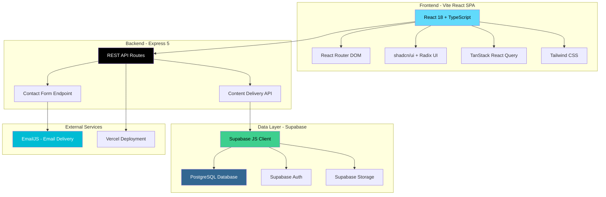
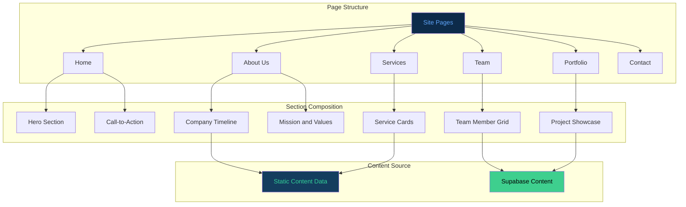
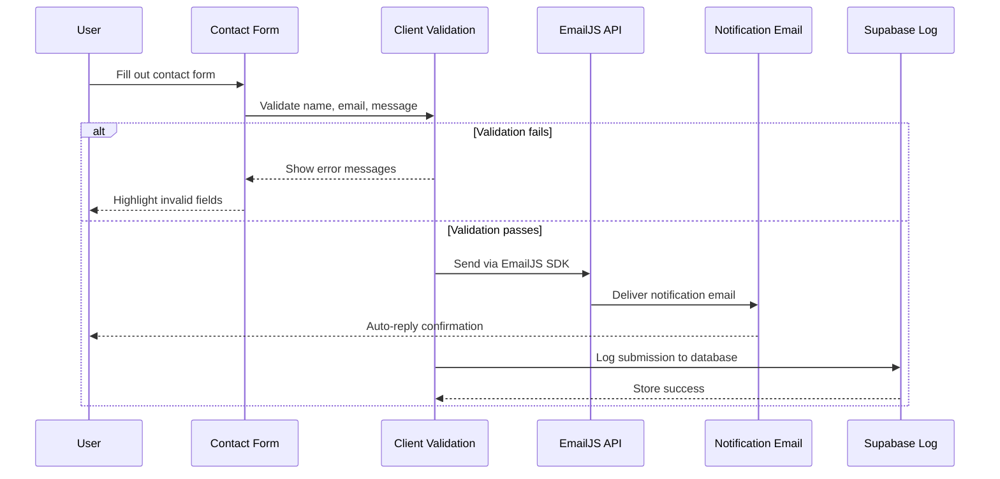

# DHAHER LABS — REALIZATION MANDATE

> **⚠️ THIS IS A REAL SYSTEM. NOT A TOOL. NOT A SIMULATION.**
> This is a REAL production system in the DHAHER LABS autonomous ecosystem.

---

> **DHAHER LABS — REALIZATION MANDATE**
> This is a REAL production system in the DHAHER LABS autonomous ecosystem.
> Not a simulation. Not a toy. Not a placeholder.
> Every component serves the autonomous organism.


<!-- CAPSULE-RENDER HEADER -->


---

## Audit Report

**Score:** 50 | Last audit: 2026-06-27

**Files:** 39 | **Dirty:** 134 | **Last commit:** 2026-06-11 | **Stack:** Vite/TypeScript (v8.0.0)

### Known Gaps
1. 134 dirty files — worktree index drift; needs reconciliation (likely global filemode or whitespace changes)
2. Uses Vite but README badges claim Next.js — actual framework identity is inconsistent
3. No test scripts configured — static company profile is low risk but still no safety net
4. Last commit 2026-06-11 — 16 days stale, no recent activity
5. Missing CI/CD for a client-facing production website

### Ecosystem Role
Corporate profile website for Yoga Wibawa Mandiri. Client-facing static presence within Dhaher Labs' web services portfolio.

<!-- TYPING SVG -->
<div align="center">
  <a href="https://git.io/typing-svg">
    
  </a>
</div>

<br/>

<!-- BADGES -->
<div align="center">

[](https://www.typescriptlang.org/)
[](https://nextjs.org/)
[](https://tailwindcss.com/)
[](./LICENSE)

</div>

---


<!-- AUTO-PACKAGE-BADGES:START -->

<!-- AUTO-PACKAGE-BADGES:END -->

## Overview

**Yoga Wibawa Mandiri** is a professional company profile website built with TypeScript and Next.js. It presents the company's services, team, history, and values in a clean, modern design that builds trust and credibility. Optimized for SEO with server-side rendering, the site ensures strong search visibility while delivering a fast, professional user experience.

## Visual Architecture

### Corporate Site Architecture



### Content Management Flow



### Contact Form Pipeline



> **Stack Note**: Yoga Wibawa Mandiri uses Vite + React 18 with Express backend and Supabase for PostgreSQL data. Contact forms are delivered via EmailJS without requiring a dedicated mail server. The site is designed as a corporate profile/CMS with server-side rendering capabilities.

---

## Features

### Company Presentation
- **Company Overview** — Mission, vision, and company history with timeline
- **Service Pages** — Detailed descriptions of company services and capabilities
- **Team Section** — Professional profiles with roles and expertise
- **Portfolio/Projects** — Showcase completed projects and case studies
- **Client Logos** — Trusted partner and client brand display

### User Experience
- **Contact Page** — Contact form, office location with map, and social links
- **Responsive Design** — Professional appearance across all devices
- **SEO Optimized** — Server-side rendering for search engine visibility
- **Fast Loading** — Optimized images and code splitting for performance
- **Dark/Light Mode** — Theme preference support

### Technical
- **CMS Ready** — Structured content management integration points
- **Analytics** — Visitor tracking and engagement metrics
- **i18n Ready** — Internationalization structure for multilingual support

## Quick Start

### Prerequisites
- Node.js 18+

### Installation

```bash
git clone https://github.com/mulkymalikuldhrs/yoga-wibawa-mandiri.git
cd yoga-wibawa-mandiri
npm install
cp .env.example .env
```

### Configuration

```env
NEXT_PUBLIC_APP_URL=http://localhost:3000
NEXT_PUBLIC_COMPANY_NAME="Yoga Wibawa Mandiri"
NEXT_PUBLIC_CONTACT_EMAIL=info@yogawibawamandiri.com
```

### Running

```bash
npm run dev
```

## Project Structure

```
yoga-wibawa-mandiri/
├── src/
│   ├── app/              # Next.js app router
│   ├── components/
│   │   ├── about/        # Company info sections
│   │   ├── services/     # Service display components
│   │   ├── team/         # Team member profiles
│   │   ├── projects/     # Portfolio showcase
│   │   └── contact/      # Contact form & map
│   ├── content/          # Static content & data
│   ├── lib/
│   │   ├── seo/          # SEO utilities
│   │   └── analytics/    # Tracking integration
│   └── types/            # TypeScript definitions
└── public/               # Static assets & images
```

---

## Contributing

1. Fork the repository
2. Create a feature branch
3. Submit a pull request

Content updates, design improvements, and SEO optimizations welcome.

## License

**MIT License** — see [LICENSE](./LICENSE) for details.

## Author

<div align="center">

**Mulky Malikul Dhaher**

[](https://github.com/mulkymalikuldhrs)
[](mailto:mulkymalikudhr@mail.com)

</div>

---

<!-- FOOTER BANNER -->


## Architecture

```mermaid

```
